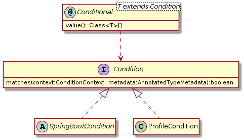

# Part 1

自发布以来，Spring Boot取得巨大成功：通过约定胜于配置的理念，提高开发人员的生产力。然而，有时，感觉太神奇。就是因为这个原因，我一直反对自动装配。当某事不生效时，很难回到正轨。

这就是为什么我想深入了解 Spring Boot starter 机制 - 理解每一个角角落落。 这篇文章是第一部分，将重点分析工作原理。 第二部分将研究创建 starter。

## spring.factories

每个 Spring Boot starter 的根源都是建立在 `META-INF/spring.factories` 文件上。 我们检查这个在 `spring-boot-autoconfigure.jar` 中的文件的内容。 这是一个摘录：

```bash
...

# Auto Configure
org.springframework.boot.autoconfigure.EnableAutoConfiguration=
org.springframework.boot.autoconfigure.admin.SpringApplicationAdminJmxAutoConfiguration,
org.springframework.boot.autoconfigure.aop.AopAutoConfiguration,
org.springframework.boot.autoconfigure.amqp.RabbitAutoConfiguration,
org.springframework.boot.autoconfigure.MessageSourceAutoConfiguration,
org.springframework.boot.autoconfigure.PropertyPlaceholderAutoConfiguration,
org.springframework.boot.autoconfigure.batch.BatchAutoConfiguration,
...
```

现在让我们看一下他们的内容。例如，类 `JpaRepositoriesAutoConfiguration` ：

```java
@Configuration
@ConditionalOnBean(DataSource.class)
@ConditionalOnClass(JpaRepository.class)
@ConditionalOnMissingBean({ JpaRepositoryFactoryBean.class, JpaRepositoryConfigExtension.class })
@ConditionalOnProperty(prefix = "spring.data.jpa.repositories", name = "enabled", havingValue = "true",  matchIfMissing = true)
@Import(JpaRepositoriesAutoConfigureRegistrar.class)
@AutoConfigureAfter(HibernateJpaAutoConfiguration.class)
public class JpaRepositoriesAutoConfiguration {}
```

有几件有趣的事情要注意：

1. 这是一个标准的 Spring `@Configuration` 类
2. 该类不包含 "实际" 代码，但导入另一个配置 - `JpaRepositoriesAutoConfigureRegistrar`，其中包含 "实际" 代码
3. 有几个@ConditionalOnXXX 注解被使用
4. @AutoConfigureAfter 似乎存在顺序依赖管理

第1点和第2点是不言而喻的，第4点相当简单，所以让我们来关注3。

## @Conditional 注解

如果您不是刚开始使用 Spring ，您可能会了解 `@Profile` 注解。Profile 是将 bean 返回方法标记为可选的方式。当 Profile 被激活时，相关的 Profile 注解的方法被调用，返回的 bean 贡献给 bean factory 。

在之前，@Profile 看起来是这个样子：

```java
@Retention(RetentionPolicy.RUNTIME)
@Target(ElementType.TYPE)
public @interface Profile {
    String[] value();
}
```

有趣的是，@Profile 已被重写，以使用新的 @Conditional 注解：

```java
@Retention(RetentionPolicy.RUNTIME)
@Target({ElementType.TYPE, ElementType.METHOD})
@Documented
@Conditional(ProfileCondition.class)
public @interface Profile {
    String[] value();
}
```

基本上，@Conditional 注解只是指向一个 Condition。反过来，Condition 是具有返回布尔值的单个方法的功能界面：如果为 true，那么 @Conditional-注解过的方法由 Spring 执行，并将其返回的对象作为 bean 添加到上下文中。



